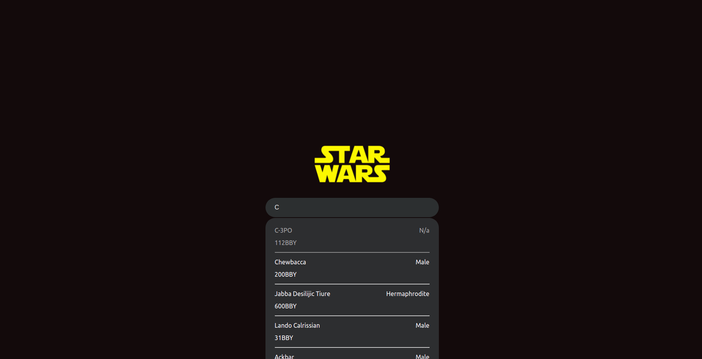
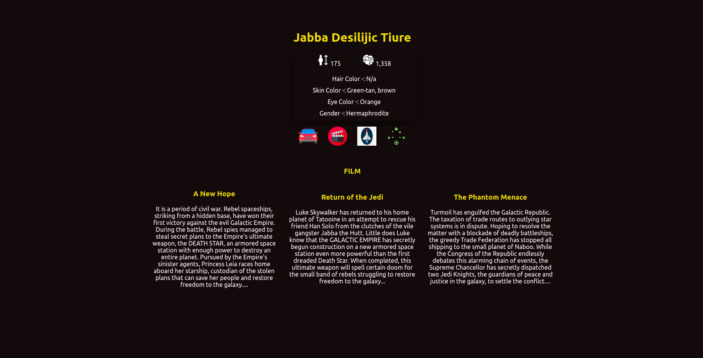
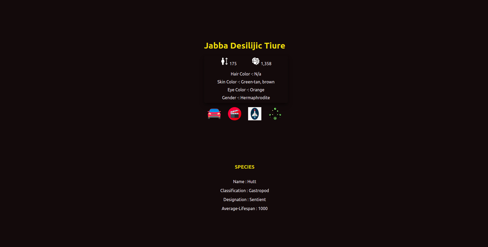
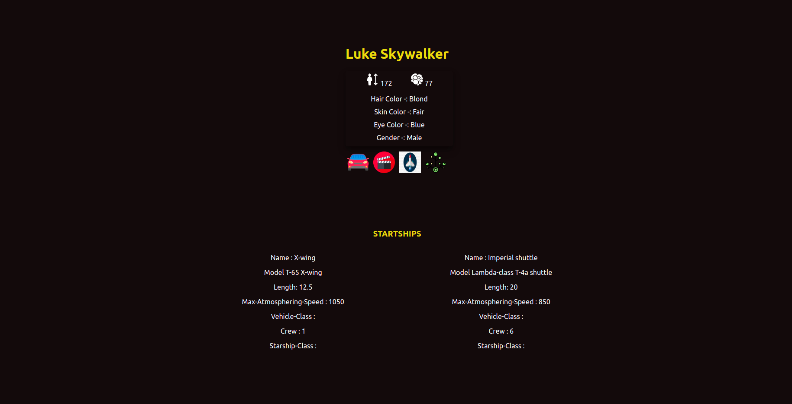
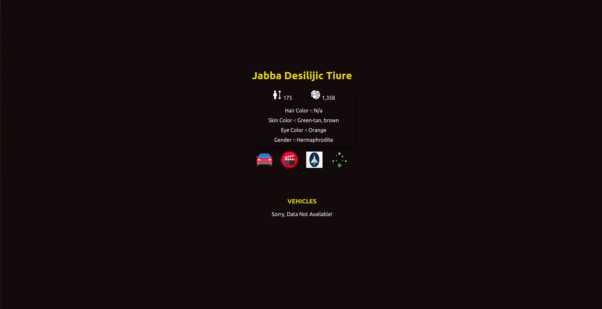
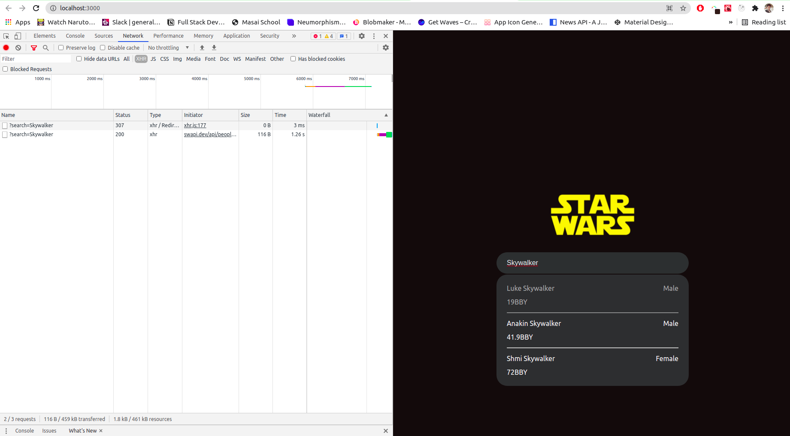

# Urban Piper Assignment

Using STAR-WARS API creating Live Search Box and Character page with some cool details about characters.

## Landing Page:

 When we click any of the search results, we move to the Person page to know cool things about Person or Character. 

## Person Page:

### film details -:

We are looking now Person or Character films details.

### Species details -:

### Starships details -:

### Vehicles details -:

## Optimized Version Of Searching -:

 As we can see, I search "Skywalker" in search box, in network tab we can see its only calling API two times, not for very character. 

### Note:-

 This website is not responsible for other devices expect laptop, still I' m working on it. Sorry for inconvenience!

